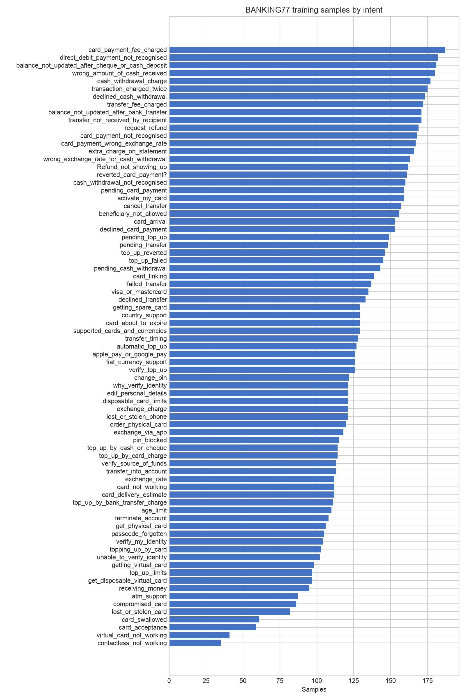
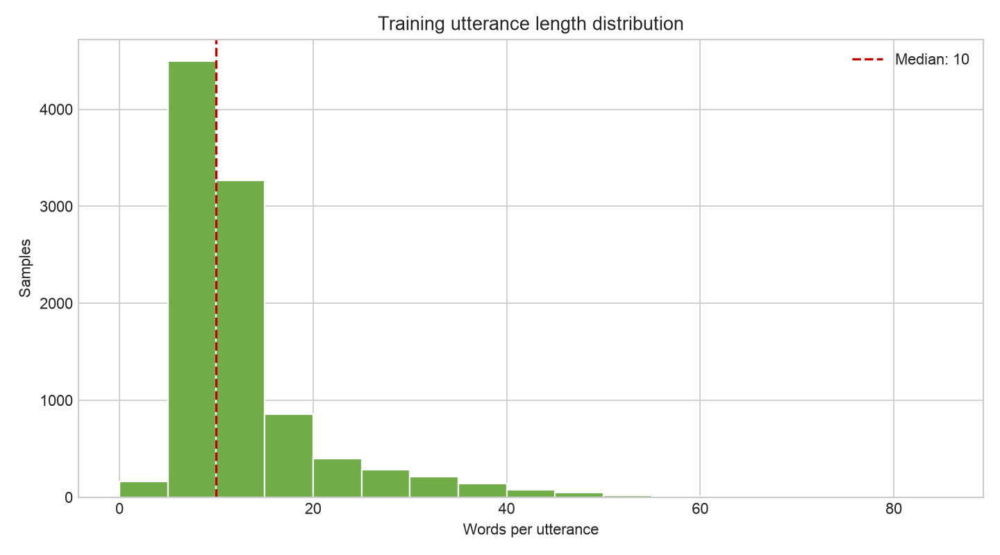
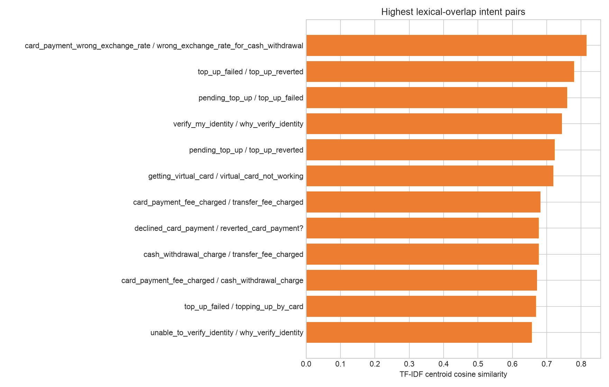
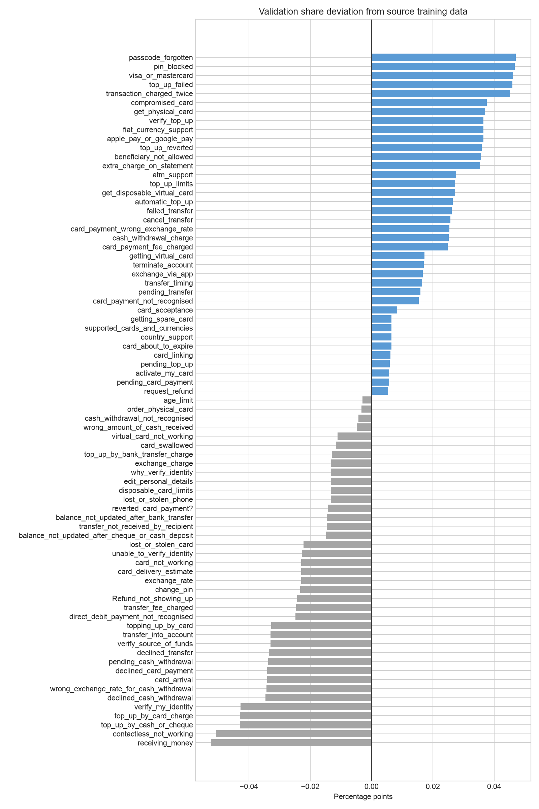

# BANKING77 EDA 报告

## 1. 数据概况

- 官方训练集：10,003 条；官方测试集：3,080 条；共 77 类。
- 两个 CSV 均无缺失值，字段为 `text` 和 `category`。
- 测试集每类固定 40 条，完全均衡；训练集每类 35–187 条。

## 2. 类别分布

训练集类别数量最大/最小比为 5.34，Gini 系数为 0.1406，归一化熵为 0.9920。数据存在温和不均衡，但不属于典型严重长尾。

- 样本最少的类别：`contactless_not_working` (35), `virtual_card_not_working` (41), `card_acceptance` (59), `card_swallowed` (61), `lost_or_stolen_card` (82)。
- 样本最多的类别：`card_payment_fee_charged` (187), `direct_debit_payment_not_recognised` (182), `balance_not_updated_after_cheque_or_cash_deposit` (181), `wrong_amount_of_cash_received` (180), `cash_withdrawal_charge` (177)。

## 3. 文本长度与词汇

- 训练文本平均 12.25 词，中位数 10 词，95 分位 30 词，最大 84 词。
- 测试文本平均 11.22 词，中位数 9 词。
- 测试 token 出现次数口径的 OOV 率为 0.69%；测试独立 token 类型口径的 OOV 率为 15.00%。

文本整体较短，`max_length=64` 可作为后续 BERT 实验的初始值，但最终应根据 tokenizer 后的长度再次确认截断比例。

## 4. 重复与潜在泄漏

- 官方训练集无完全相同的 `text + category` 重复行；宽松标准化后有 31 个重复文本组、62 行，包含 1 个跨标签组。
- 官方测试集宽松标准化后有 4 个重复文本组，其中 1 个跨标签组。
- 官方 train/test 间有 25 个标准化文本重叠组，标签不一致组数为 0。这是官方 benchmark 的既有特征，主实验保留并在报告中披露。
- 新生成的 train/validation 之间标准化文本重叠为 0，没有由内部划分引入重复泄漏。

## 5. 高词面重叠类别

下表按每类 TF-IDF 质心余弦相似度排序，只代表词面重叠候选，不等同于模型 confusion matrix。训练基线后应以真实误判重新确定 hard-negative intent pairs。

| Intent A | Intent B | Cosine similarity |
|---|---|---:|
| `card_payment_wrong_exchange_rate` | `wrong_exchange_rate_for_cash_withdrawal` | 0.816 |
| `top_up_failed` | `top_up_reverted` | 0.779 |
| `pending_top_up` | `top_up_failed` | 0.760 |
| `verify_my_identity` | `why_verify_identity` | 0.745 |
| `pending_top_up` | `top_up_reverted` | 0.723 |
| `getting_virtual_card` | `virtual_card_not_working` | 0.719 |
| `card_payment_fee_charged` | `transfer_fee_charged` | 0.682 |
| `declined_card_payment` | `reverted_card_payment?` | 0.677 |
| `cash_withdrawal_charge` | `transfer_fee_charged` | 0.677 |
| `card_payment_fee_charged` | `cash_withdrawal_charge` | 0.671 |

## 6. 训练/验证划分

- 随机种子：42。
- 划分方式：按 `category` 分层；初始划分后将标准化重复文本收拢到同一侧，并用同类 singleton 对换，保持每类数量不变。
- 训练集：9,000 条；验证集：1,003 条；官方测试集 3,080 条保持不变。
- 验证集每类 3–19 条；相对官方训练集的最大类别占比偏差仅 0.052 个百分点。
- 划分文件位于 `outputs/datasets/`，完整源索引、源文件哈希和修复记录保存在 `split_manifest.json`。

## 7. 对后续实验的建议

1. 固定本次验证集用于 checkpoint 与超参数选择，官方测试集只用于最终评估。
2. few-shot 样本仅从 9,000 条训练池抽取，验证集不计入标注预算。
3. 主指标使用 Macro-F1，并报告 per-class F1；训练基线后从 confusion matrix 识别真实易混淆类别对。
4. 由于存在少量标准化重复及跨标签近重复，最终报告应披露清洗口径，并可补充一次去重敏感性实验。
